<div align="center">


### ❝ Vibe Coding: Where intuition meets system architecture. ❞

<p align="center">
  
  
  
  
</p>

</div>

---

### `[ 0x01 ] KERNEL_PANIC // ABOUT_ME`

```bash
#!/bin/bash
# IDENTITY: Michael Irungu Muriithi (Phantomojo)
# ROLE: AI-Native Architect | Cybersecurity Specialist | Systems Orchestrator
# LOCATION: Nairobi, Kenya
# OPERATIONAL_MODE: AI_ASSISTED_ARCHITECTURE [100% INDEPENDENT]

class Phantomojo:
    def __init__(self):
        self.architecture = ["P2P_Mesh", "Zero_Trust", "Offline_First"]
        self.languages = ["Python", "Rust", "TypeScript", "Bash"]
        self.domains = ["Cybersecurity", "AI/ML", "FinTech", "SystemArch"]
        self.philosophy = "Build the future, one line at a time."
        self.method = "Vibe Coding: AI handles syntax, I architect intelligence"

    def execute(self):
        return "Innovation.deployed()"
```

---

### ❝ **PHILOSOPHY_KERNEL** // THE_MANIFESTO ❞

> **"Vibe Coding" is high-velocity system orchestration.**

In an era where AI handles the syntax, the engineer elevates to become the **Architect of Intelligence**. I don't just write code; I weave together neural networks, cryptographic protocols, and distributed systems into living, breathing digital ecosystems.

**My Approach:**
```
┌─────────────────────────────────────────────────────────┐
│  TRADITIONAL DEV (2010-2025):                          │
│  Learn syntax → Practice → Build → Ship (2-5 years)    │
│                                                         │
│  AI-NATIVE DEV (2026+): ← THIS IS ME                   │
│  Know WHAT → Know WHY → AI writes HOW → Learn by doing │
│  Ship in weeks, understand over months, master in year │
└─────────────────────────────────────────────────────────┘
```

**My Directive:** Transform abstract intuition into concrete, mission-critical systems at the speed of thought.

---

### `[ 0x01a ] SYSTEM_ARCHITECTURE // THE_ORCHESTRATION`

```mermaid
flowchart TD
    User(("PHANTOMOJO"))

    subgraph AI_CORE ["ARTIFICIAL_INTELLIGENCE"]
        HRM["HRM Reasoning_Model"]
        LLM["Llama-3.1 70B"]
        Transformers["HuggingFace"]
        Whisper["Faster-Whisper"]
    end

    subgraph SEC_GRID ["CYBERSECURITY_GRID"]
        Ghost["GhostWire Mesh_Net"]
        Cerberus["Cerberus Honeypot"]
        Forensic["DFIR_Analysis"]
    end

    subgraph FIN_OPS ["FINANCIAL_OPERATIONS"]
        Hedge["HedgeFund-Lite Algo"]
        Vanta["Vanta-Ledger"]
        MT5["MetaTrader5"]
    end

    subgraph INFRA ["INFRASTRUCTURE"]
        Docker["Docker/K8s"]
        Tailscale["Tailscale_ZeroTrust"]
        GCP["Google_Cloud"]
    end

    User --> AI_CORE
    User --> SEC_GRID
    User --> FIN_OPS
    User --> INFRA

    AI_CORE -.-> FIN_OPS
    SEC_GRID -.-> INFRA
    FIN_OPS -.-> INFRA

    style User fill:#DB9202,stroke:#010205,stroke-width:3px,color:#010205
    style AI_CORE fill:#010205,stroke:#DB9202,stroke-width:2px
    style SEC_GRID fill:#010205,stroke:#DB9202,stroke-width:2px
    style FIN_OPS fill:#010205,stroke:#DB9202,stroke-width:2px
    style INFRA fill:#010205,stroke:#DB9202,stroke-width:2px
```



---

### `[ 0x02 ] WEAPONRY // TECH_STACK`

<div align="center">

| **CORE_LANGUAGES** | **AI_ML** | **SECURITY** | **INFRASTRUCTURE** |
|:---:|:---:|:---:|:---:|
|  |  |  |  |
|  |  |  |  |
|  |  |  |  |
|  |  |  |  |

**ADDITIONAL Arsenal:**


</div>

---

### `[ 0x03 ] MISSION_LOGS // FLAGSHIP_PROJECTS`

#### 🛡️ **[PROTOCOL: GHOSTWIRE]** — *Production-Ready Decentralized Mesh*
> **Secure Mesh Communication System for Anonymous Threat Intelligence**

```
STATUS: ████████████████████ 100% DEPLOYED
TECH: Rust (Axum) | React + TypeScript | libp2p | AES-256-GCM | Docker
INNOVATION: Stealth TCP handshake, gossipsub protocol, Kademlia DHT
COMMERCIAL: Dual license (AGPL-3.0 + Commercial)
```

**Capabilities:**
- `P2P Networking`: Direct encrypted channels with neighbor discovery
- `Zero-Trust Architecture`: End-to-end encryption with key rotation
- `Self-Healing Mesh`: Automatic peer discovery and reconnection
- **Access:** [GhostWire Repository](https://github.com/Phantomojo/GhostWire-secure-mesh-communication)

---

#### 🍯 **[PROJECT: CERBERUS]** — *Research-Grade Bio-Adaptive Honeypot*
> **High-Fidelity IoT Honeynet with Tactical HUD Interface**

```
STATUS: ████████████████████ 100% OPERATIONAL
TECH: C | Rust | React | GCP | SQLite | WebSocket
INNOVATION: Identity morphing, quorum sensing, Shodan integration
```

**Capabilities:**
- `Deception Engines`: C-based high-performance honeypot services
- `Phoenix HUD`: Real-time tactical attack visualization
- `AI Enrichment`: Automated attacker profiling via Shodan
- **Access:** [Cerberus Repository](https://github.com/Phantomojo/cerberus-honeypot)

---

#### 🧠 **[MODEL: VERBA]** — *Consumer-Ready Offline AI*
> **Privacy-First Meeting Transcription & Summarization**

```
STATUS: ████████████████████ 100% CONSUMER-READY
TECH: Python | FastAPI | faster-whisper | Tauri | React | SQLite
INNOVATION: 100% offline operation, system audio capture
BUILD: DEB, RPM, MSI, DMG packages ready
```

**Capabilities:**
- `Offline Transcription`: Local Whisper, no cloud dependency
- `System Audio Capture`: Direct audio stream processing
- `Multi-Language`: Support for 100+ languages
- **Access:** [Verba Repository](https://github.com/Phantomojo/Verba-mvp)

---

#### 📈 **[ENGINE: HEDGEFUND-LITE]** — *Algorithmic Trading Core*
> **Production-Hardened Trading System with 66+ ML Features**

```
STATUS: ████████████████████ 100% OPERATIONAL
TECH: Python (FastAPI) | PyTorch | Transformers | Celery | Redis | K8s
FEATURES: 66+ ML features, sentiment analysis, automated risk management
```

**Capabilities:**
- `Sentiment Analysis`: HuggingFace Transformers for market mood
- `Risk Management`: Automated stop-loss with Prometheus monitoring
- `High Performance`: AsyncPG + Redis caching
- **Access:** [HedgeFund-Lite Repository](https://github.com/Phantomojo/hedgefund-lite)

---

#### 🗺️ **[SYSTEM: GLOBAL_THREAT_MAP]** — *OSINT Command Center*
> **Real-Time Geopolitical Event Tracking & Intelligence**

```
STATUS: ████████████████████ 100% ENTERPRISE-GRADE
TECH: Next.js 16 | Mapbox GL | Valyu AI | Zustand | TailwindCSS v4
INNOVATION: AI-powered deep research, 50-page intelligence reports
```

**Capabilities:**
- `Real-Time Mapping`: Color-coded threat levels globally
- `Intel Dossiers`: AI-generated 50-page country reports
- `Military Layers`: US/NATO base visualization
- **Access:** [Global Threat Map Repository](https://github.com/Phantomojo/globalthreatmap)

---

### `[ 0x03a ] CIVILIAN_SECTOR // FULL_STACK_OPS`

#### 🧬 **[PLATFORM: MALI-CONNECT]** — *AI Livestock Assessment*
```
TECH: React 19 | TypeScript | Three.js | Llama 3.1 70B
STATUS: DEPLOYED
```
**Access:** [Mali-Connect](https://github.com/Phantomojo/mali-connect-app)

#### 🌾 **[SYSTEM: MAONO]** — *Agricultural Intelligence*
```
TECH: React 18 | TypeScript | Material-UI | Geospatial Data
STATUS: ACTIVE
```
**Access:** [Maono Agriculture](https://github.com/Phantomojo/maono-agriculture-platform)

---

### `[ 0x03b ] RESEARCH_DIVISION // ACTIVE_INVESTIGATIONS`

<details>
<summary>📂 ACCESS_CLASSIFIED_PROJECTS</summary>

#### 🛡️ **[SYSTEM: SENTRI]** — *AI-Orchestrated Security*
> Mobile Money Security & Hardware-bound Authentication
```
TECH: Node.js | AI Risk Engine | Geo-Velocity Checks
STATUS: CLASSIFIED
```

#### 🔍 **[TOOL: SAMSCOPE]** — *Python Security Analysis*
> Advanced security scoping and analysis tool
```
TECH: Python | Security Auditing
STATUS: ACTIVE
```

#### 🛰️ **[INITIATIVE: ORUN.IO]** — *Orbital Analytics*
> Satellite-based climate impact verification
```
TECH: Three.js | Blockchain | Satellite Constellations
STATUS: ORBITAL
```

</details>

---

### `[ 0x04 ] SYSTEM_ROADMAP // NEXT_BOOT`

| **PRIORITY** | **DIRECTIVE** | **STATUS** | **ETA** |
|:---:|:---|:---:|:---:|
| 1 | **GhostWire Commercial Launch** | `🟢 INITIALIZING...` | Q2 2026 |
| 2 | **Quantum-Resistant Cryptography** | `🟡 RESEARCHING...` | Q3 2026 |
| 3 | **Autonomous AI Agents (Swarm)** | `🟡 DESIGNING...` | Q4 2026 |
| 4 | **Web3 / Smart Contract Auditing** | `🔴 QUEUED...` | Q1 2027 |

---

### `[ 0x05 ] INTEL_FEED // CURRENT_STATE`

```bash
$ cat /home/ph/.state/current

READING:
  - System Design Interview by Alex Xu
  - Post-Quantum Cryptography (Research Papers)

LISTENING:
  - Darknet Diaries (Ep. 132: "The Spy")
  - Lo-fi / Cyberpunk Soundtracks

EXPLORING:
  - Rust Async Runtimes (Tokio vs Smol)
  - libp2p Protocol Extensions
  - AI Agent Swarm Coordination

BUILDING:
  - GhostWire Commercial License
  - Cerberus Cloud SaaS
  - Verba Desktop v2.0
```

---

### `[ 0x06 ] TELEMETRY // STATISTICS`

<div align="center">


</div>

---

### `[ 0x07 ] COGNITIVE_PROFILE // OPERATING_CHARACTERISTICS`

> **Note:** This is how I work, not a limitation.

```
┌─────────────────────────────────────────────────────────┐
│  COGNITIVE_ARCHITECTURE: AuDHD (Self-Identified)       │
│                                                         │
│  SUPERPOWERS:                                           │
│  ✓ Hyperfocus on interesting problems (6+ hour blocks) │
│  ✓ Pattern recognition across unrelated domains        │
│  ✓ Obsessive curiosity (cannot stop until solved)      │
│  ✓ Systems thinking (ecosystems, not apps)             │
│  ✓ Aesthetic perfectionism (every pixel calibrated)    │
│                                                         │
│  CHALLENGES:                                            │
│  ⚠ Executive function (planning ≠ execution)           │
│  ⚠ Task alternation (need novelty within interests)    │
│  ⚠ Sleep schedule (night owl: 00:00-06:00 peak)        │
│                                                         │
│  COPING_STRATEGIES:                                     │
│  ✓ AI-assisted syntax (I architect, AI writes)         │
│  ✓ Just-in-time learning (use first, understand later)│
│  ✓ Environment engineering (custom terminal, themes)   │
│  ✓ Systematic problem-solving methodology              │
└─────────────────────────────────────────────────────────┘
```

**Why This Matters:**
- **65,000+** developers in r/ADHD_Programmers
- Tech industry is **unusually accommodating** for neurodivergent folks
- Many senior/lead engineers are AuDHD
- **Different is not less** — it's complementary

---

### `[ 0x08 ] ENCRYPTED_UPLINK // CONTACT`

> Establishing secure connection...

| **CHANNEL** | **TERMINAL** |
|:---:|:---:|
| **EMAIL** | [mirungu015@proton.me](mailto:mirungu015@proton.me) |
| **LINKEDIN** | [Michael Irungu Muriithi](https://www.linkedin.com/in/michael-irungu-8a233926a) |
| **LOCATION** | `Nairobi, Kenya` |
| **AVAILABILITY** | `Remote | Contract | Consulting` |

**Available For:**
- Security Architecture Consulting
- AI/ML System Design
- P2P/Decentralized Systems
- Technical Due Diligence
- Speaking Engagements (Cybersecurity, AI-Native Development)

---

<div align="center">


**"I don't chase the spotlight — I rewire the shadows."**

*Last Updated: March 29, 2026*

</div>
